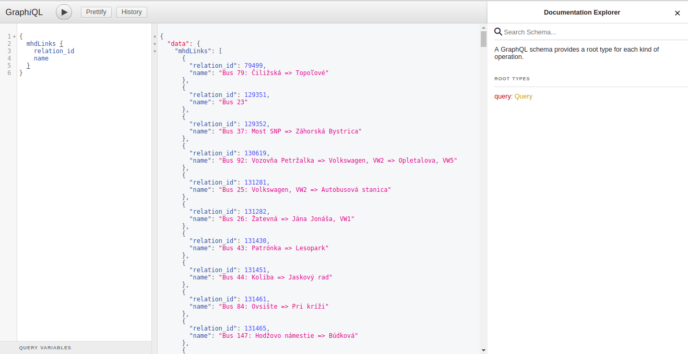
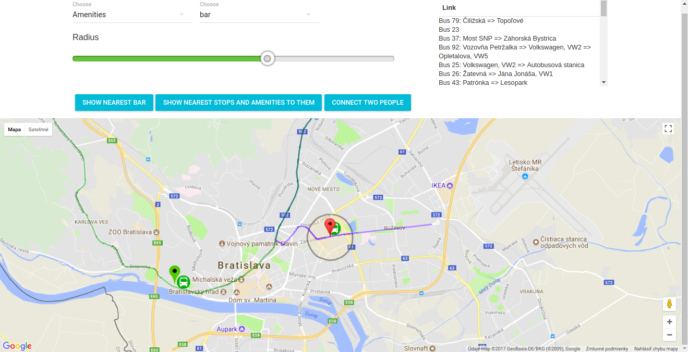
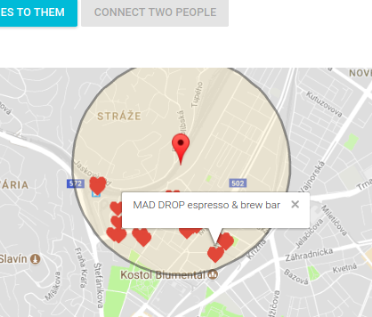
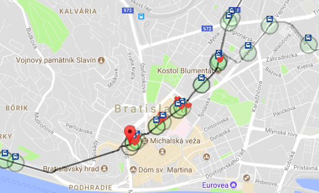
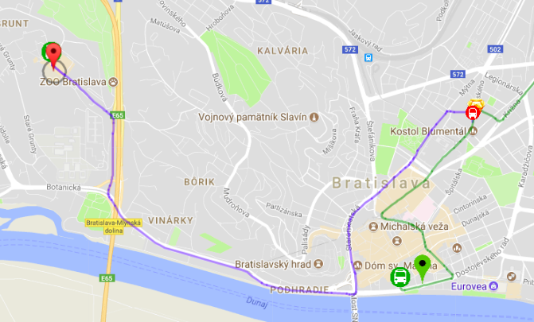
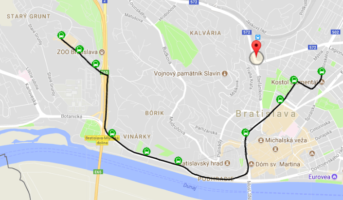

# Dokumentácia k semestrálnemu projektu z predmetu Pokročilé databázové technológie


# 1. Úvod

Toto zadanie rieši najmä dopyty pre MHD mesta Bratislava.

## 1.1 Architektúra

### 1.1.1 Architektúra klienta
***Klient*** bol skonštruovaný pomocou knižnice *React* v jazykoch javascript, html a css.

### 1.1.2 React
React je knižnica, umožňujúca single page aplikácie. Výhodou je rýchly rendering, component based architektúra.

### 1.1.3 Redux
Redux je knižnica pre správu stavu v celej aplikácie. Stav vieme manažovať aj v komponentoch, ktoré maju stavy - ale ak komponenty začnu rásť na hĺbke v strome, je ich často krát ťažké manažovať a rozširovať. Redux poskytuje jeden *store*, ktorý ponúka podľa potreby každého komponentu svoj stav, alebo čiastový stav.
Ak nejaký komponent zmení stav storu, redux automaticky notifikuje všetky komponenty, ktoré závisia na tejto časti storu a zmenia svoju hodnotu.

**Jednoduché vysvetlenie: komponent volá akcie, reducer mení podľa akcie stav storu, store notifikuje všetkých, ktorý na ňom počúvajú - resp. počúvajú a sú závislý len na konkrétnej časti storu.**


***Server*** bol skonštruovaný pomocou jazyku javascript v node.js vo frameworku *Express*

***Dopytovací systém*** - na dopytovací systém medzi klientom a serverom som použil GraphQL, ktorý sa líši od RestAPI tým, že ma iba jeden endpoint, a dopytuje sa pomocou query napísanej v stringu. Výhodou je: 

- jasná orientácia 
- silnejší typovací systém 
- automatická dokumentácia pomocou interaktívného prostredia, ktoré je dostupné na endpointe */graphiql*
- možnosť spájať dopyty na servery, pokiaľ mám zložitý dopyt a môžem obetovať performance za cenu lepšieho prehľadu čo a kde dopytujem - dopytuje sa po grafoch.




# 1.2 Rozloženie stránky (FrontEnd)

Horný panel s nastaveniami - obsahuje jeden select, ktorý nám dáva možnosť vybrať si buď obchody alebo služby
Na pravo v panely je tabuľka so všetkými linkami v Bratislave.
V tomto panely sa nachádza taktiež radius slider, s možnosťou nastavenia radiusu. Táto hodnota bude ďalej slúžiť pre dopyty, ktoré sú popísané neskôr.


Ďalej sa na stránke nachádza full width mapa. S touto mapou môžeme interagovať následovne: kliknutím ľavým tlačidlom myši
nastavím hlavný pointer, tzv. *MainMarker*. Pravým tlačidlom myši vieme nastaviť pomocný pointer, tzv. *SecondaryPointer*





# 2. Dopyty

## 2.1 Najbližšie služby a obchody

Pre tento dopyt je potrebné, aby bol na mape zakliknutý *MainMarker*. Ten slúži potom ako záchytný bod, podľa ktorého sa budú jedna, alebo aj viacej dopytov odkazovať.

V prvom dopyte je možnosť nájsť všetky služby/obchody v rozpätí *X* metrov. Defaultná hodnota je hľadať všetky *cafe* do *100*m od začiatočného bodu *MainMarkera*, ktorý sa nachádza v centre Bratislavy.



## 2.2 Najbližšie služby a obchody pri zastávkach, ktoré mám po ceste

Predstavme si, že som zo zahraničia a mám kúpený lístok na MHD, ktorý je platný na celý deň. Nechcem ale ostať na jednom mieste, ale chcem sa pohnúť na iné miesto v meste, pričom chcem zvoliť také miesto, pri ktorom je nejaká služba



## 2.3 Spojiť 2 ľudí na jednom mieste (pri jednej službe)

Táto situácia nastáva často, dvaja kamaráti bývajú na rôznych miestach v meste a chcú sa stretnúť a pokecať si pri káve alebo pive. V tomto prípade zadajú ich pozície a miesto alebo službu, kam by sa rád išli stretnúť. Napríklad na kávu.

Potom sa na mape zobrazí:
- zástavka na ktorej má nastúpiť prvá osoba
- zastávka na ktorej má nastúpiť druhá osoba
- zastávka na ktorej má vystúpiť prvá osoba
- zastávka na ktorej má vystúpiť druhá osoba
- miesto stretnutia

Dopyt je prispôsobený tak, aby obaja prešli čo najmenšiu vzdialenosť k zastávkam - nie je zaručené, že sa taká zastávka nájde -> prvý nebude chcieť ísť kilometer peši na zastávku, z ktorej nejaká linka ide priamo k miestu stretnutia. Tento dopyt nemusí vrátiť výsledok.



## 2.4 Jednoduchá query = zobrazenie konkrétnej linky a jej dráh a zastávok

Jednoduchý ale účinný dopyt, pokial chceme zistiť, kam a po akých zastávkach smeruje daná linka.
V hornom rohu na pravo v aplikácií je tabuľka so všetkými linkami. Po kliknuti na jednu z nich sa vykreslí cesta.



## 3. Deployment

Client - defaultne štartuje na porte 3000

 - pre development 
 ```bash
 	cd client
 	npm run start
 ```
 - pre spustenie build verzie
 ```bash
 	cd client
 	serve -s build
 ```

Server - defaultne štartuje na porte 3001
```bash
	cd server
	npm run start
```

## 4.API

Každý serverový dopyt pomocou graphql je odtestovateľný na serverovom endpointe /graphiql
Toto nie je klasický REST API, ale grafový API - správa sa trochu inak. Typová dokumentácia je na pravom boku. 
